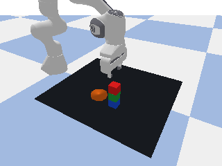

# GPT-LMPs-RL：基于语言模型程序与价值学习的机械臂操作系统

### 场景介绍

本项目在 PyBullet 中构建一个 Franka Panda 7 自由度机械臂桌面操作场景。场景中包含红、蓝、绿
三种可抓取方块、一个目标容器、顶部 RGB-D 相机和观察相机。用户输入自然语言指令后，GPT
将任务转换为分层 Language Model Programs（LMPs），LMP 再调用抓取、放置或堆叠原语，最后由
IK、Q-Learning 或 DQN 控制机械臂执行。

项目当前面向以下任务：

- 将指定方块放到另一个方块或容器上；
- 将方块移动到桌面左上、右上、左下或右下区域；
- 根据指定顶部方块完成多物体顺序堆叠；
- 查询物体名称、位置、数量和相对空间关系。



### 所属领域

具身智能、Franka机械臂操作、语言条件任务规划。

### 复现工作说明
- Liang, Jacky, et al. "Code as policies: Language model programs for embodied control." International conference on robotics and automation (ICRA), 2023.
- Dalal, Murtaza, et al. "Plan-seq-learn: Language model guided rl for solving long horizon robotics tasks." International Conference on Learning Representations (ICLR), 2024.
- Watkins, Christopher JCH, and Peter Dayan. "Q-learning." Machine learning 8.3 (1992): 279-292.
- Mnih, Volodymyr, et al. "Human-level control through deep reinforcement learning." nature 518.7540 (2015): 529-533.

## 2. LLM(GPT/DeepSeek)

### 2.1 GPT-3实现(已弃用)

原始 GPT-3 复现接口参考:

[Code as Policies官方实现](https://github.com/google-research/google-research/blob/master/code_as_policies/Interactive_Demo.ipynb)

[OpenAI模型弃用记录](https://developers.openai.com/api/docs/deprecations)。

### 2.2 DeepSeek(deepseek-v4-flash)

保证该项目的完整架构，已将后端替换成 `deepseek-v4-flash`，实际地址为 `https://api.deepseek.com`。

#### API调用方式

由于 DeepSeek 提供 OpenAI Responses API 的兼容接口，本项目复用 `openai` Python SDK：

```python
import os
from openai import OpenAI

client = OpenAI(
    api_key=os.environ["DEEPSEEK_API_KEY"],
    base_url="https://api.deepseek.com",
)
response = client.responses.create(
    model="deepseek-v4-flash",
    instructions=system_prompt,
    input=f"LMP stage: {name}\nContext:\n{context}\n\nQuery:\n{query}",
    reasoning={"effort": "none"},
)
python_source = response.output_text.strip()
```

注意：API 需要进行替换
```bash
export DEEPSEEK_API_KEY="your-own-api-key"
```

### 2.3 实际输入与标准格式替换

#### 用户输入
```text
stack all blocks with the red block on top
```

#### 环境信息
```json
{
  "objects": ["red block", "blue block", "green block", "orange bowl"],
  "positions": {
    "red block": [0.43, -0.12],
    "blue block": [0.55, 0.04],
    "green block": [0.61, 0.16],
    "orange bowl": [0.48, 0.19]
  }
}
```

#### LLM实际传入信息
```text
LMP stage: planner
Context:
{"objects": [...], "positions": {...}}

Query:
stack all blocks with the red block on top
```

## 3. LMPs

### 3.1 LMP输出格式

| LMP | 输入 | 必须生成的输出 | 输出类型或示例 |
|---|---|---|---|
| `planner` | 完整自然语言任务 | 调用一个或多个 `composer()` | `composer('put green block on blue block')` |
| `composer` | 一个单步任务 | 调用机器人高层原语 | `put_first_on_second('green block', 'blue block')` |
| `parse_obj_name` | 模糊物体描述 | 赋值给 `ret_val` | 字符串或字符串列表 |
| `parse_position` | “右上角”等位置描述 | 赋值给 `ret_val` | 机器人基坐标系中的二维坐标 |
| `parse_question` | 数量或相对位置问题 | 赋值给 `ret_val` | 布尔值、数值、字符串或列表 |
| `transform_shape_pts` | 点集变换要求 | 赋值给 `new_shape_pts` | 变换后的二维点集 |

#### 用户输入
```text
stack all blocks with the red block on top
```

#### Planner输出
```python
composer('put green block on blue block')
composer('put red block on green block')
```

#### composer
```python
put_first_on_second('green block', 'blue block')
put_first_on_second('red block', 'green block')
```

#### AST(Abstract Syntax Tree)
模型输出
```python
put_first_on_second('red block', 'blue block')
```

AST解析
```python
函数调用
├── 函数名：put_first_on_second
├── 参数1："red block"
└── 参数2："blue block"
```

### 3.2 控制机械臂
`TabletopScene` 任务展开：

| 阶段 | 末端目标的含义 | 夹爪状态 |
|---|---|---|
| `pre_grasp` | 移动到源物体正上方安全高度 | 张开 |
| `grasp` | 下降到抓取高度 | 张开后闭合 |
| `lift` | 把物体抬回安全高度 | 闭合 |
| `transport` | 水平移动到目标上方 | 闭合 |
| `place` | 下降到目标放置高度 | 闭合 |
| `release` | 解除物体约束并松开夹爪 | 张开 |
| `retreat` | 末端撤回安全高度 | 张开 |

任务输出提供
```text
target_position    = [x, y, z]
target_orientation = 末端朝下四元数 [qx, qy, qz, qw]
```

## 4. IK、Q-Learning、DQN(底层控制器)

### 4.1 控制接口

```python
result = controller.move_to(
    robot,
    target_position,
    target_orientation=down_orientation,
    step_simulation=scene.step_simulation,
)
```

`MotionResult` 为实际控制器返回：是否成功、控制步数、最终位置误差、最终姿态误差和终止原因。

执行器只依赖该接口进行生成，支持控制器接口复用。

新控制器需实现 `move_to()`，再调用 `register_motion_controller()` 进行注册：

```python
from gpt_lmps.control import register_motion_controller

register_motion_controller(
    "my_controller",
    lambda checkpoint: MyController(checkpoint),
)
```

### 4.2 IK

`IKController` 

```text
末端目标位置[x,y,z] + 四元数(Z轴向下)
        ↓
PyBullet calculateInverseKinematics
        ↓
7维目标关节角
        ↓
关节限位裁剪 + POSITION_CONTROL
        ↓
末端位置误差闭环判断
```

IK 求解时使用 Panda 七个关节的上下限、关节运动范围和 HOME 姿态作为 rest pose。它适合验证
LLM/LMP 规划链路和提供稳定对照。

### 4.3 RL

#### State

| 字段 | 维度 | 定义 |
|---|---:|---|
| $q_t$ | 7 | Panda七个机械臂关节角 |
| $\dot q_t$ | 7 | 七个关节速度 |
| $\Delta p_t$ | 3 | 目标末端位置减当前末端位置 |
| $\Delta r_t$ | 3 | 轴角表示，分解成三分量的轴角乘积(θu) |


#### Action
15维的动作信息

```text
动作0：保持当前关节目标
动作1/2：关节1正向/反向增量
动作3/4：关节2正向/反向增量
...
动作13/14：关节7正向/反向增量
```

#### 约束
- 变化角度增量约束 `0.035 rad`，执行前进行关节裁剪；
- 设置的 PyBullet 的物理时间步长为 `1 / 240 s`；
- RL控制频率为 `20 Hz`，即单一策略动作选择后，环境连续执行 `12 次` 动力学操作；
- 末端距离距离目标距离小于 `2.5 厘米`，认为子任务完成；
- 每个训练回合，RL最多策略动作数量为 `160 步`，即 `1920 个` PyBullet物理步，`8 s` 物理时间；
- 每个推理回合，RL最多策略动作数量为 `180 步`。

#### 奖励函数

$$
\begin{aligned}
r_t={}&8(d_{t-1}-d_t)+0.35(e_{t-1}-e_t)-0.35d_t-0.015e_t\\
&-0.10C_{limit}-0.25\mathbb I_{collision}-0.01
+10\mathbb I_{success},
\end{aligned}
$$

其中 $d_t=\|\Delta p_t\|_2$ 为末端位置误差，$e_t=\|\Delta r_t\|_2$ 为末端姿态误差。

| 奖励项 | 设计目的 |
|---|---|
| $8(d_{t-1}-d_t)$ | 奖励末端向目标靠近，提供主要稠密学习信号 |
| $0.35(e_{t-1}-e_t)$ | 奖励夹爪姿态向朝下目标姿态收敛 |
| $-0.35d_t$ | 持续惩罚较大的位置误差，避免停在远处 |
| $-0.015e_t$ | 持续惩罚姿态偏差 |
| $-0.10C_{limit}$ | 惩罚关节接近上下限，减少不可操作姿态 |
| $-0.25\mathbb I_{collision}$ | 惩罚机械臂自碰撞 |
| $-0.01$ | 时间惩罚，鼓励使用更少动作到达 |
| $+10\mathbb I_{success}$ | 路点到达时提供明显终止奖励 |

## 5. 工程结构

```text
GPT-LMPs-RL/
├── .env.example                    
├── scripts/
│   ├── run_demo.py
│   ├── train_controller.py
│   └── evaluate_controller.py
├── src/gpt_lmps/
│   ├── control/
│   │   ├── base.py                 
│   │   ├── ik.py                   
│   │   ├── reach.py                
│   │   ├── value_based.py          
│   │   └── __init__.py            
│   ├── envs/
│   │   ├── camera.py               
│   │   ├── robot.py               
│   │   ├── scene.py               
│   │   └── joint_reach_env.py     
│   ├── llm/
│   │   └── backends.py            
│   ├── lmp/
│   │   ├── core.py                
│   │   ├── pipeline.py            
│   │   ├── prompts.py             
│   │   └── safety.py              
│   ├── rl/
│   │   ├── q_learning.py          
│   │   ├── train.py              
│   │   └── evaluate.py           
│   ├── demo.py                    
│   ├── types.py                  
│   └── world.py                  
├── tests/
│   ├── test_controller_registry.py
│   ├── test_env_smoke.py
│   ├── test_llm_backend.py
│   ├── test_pipeline.py
│   ├── test_q_learning.py
│   └── test_safety.py
├── pyproject.toml
├── requirements.txt
├── requirements-rl.txt
├── LICENSE
└── README.md
```

## 6. 运行方式

建议使用 Python 3.10。

### GPT - LMPs

```bash
export DEEPSEEK_API_KEY="your-own-api-key"

gpt-lmps-demo \
  --backend deepseek \
  --model deepseek-v4-flash \
  --instruction "move the blue block to the top right corner"
```

### IK

```bash
gpt-lmps-demo \
  --simulate \
  --controller ik \
  --instruction "put the green block on the blue block" \
  --output outputs/ik_result.png
```

### Q-Learning

```bash
gpt-lmps-train \
  --algorithm q_learning \
  --episodes 8000 \
  --output-dir outputs/q_learning

gpt-lmps-eval outputs/q_learning/q_table.npz \
  --algorithm q_learning \
  --episodes 50

gpt-lmps-demo \
  --simulate \
  --controller q_learning \
  --checkpoint outputs/q_learning/q_table.npz \
  --instruction "put the green block on the blue block"
```

### DQN

```bash
gpt-lmps-train \
  --algorithm dqn \
  --timesteps 300000 \
  --output-dir outputs/dqn

gpt-lmps-eval outputs/dqn/final_model.zip \
  --algorithm dqn \
  --episodes 50

gpt-lmps-demo \
  --simulate \
  --controller dqn \
  --checkpoint outputs/dqn/final_model.zip \
  --instruction "put the green block on the blue block"
```
